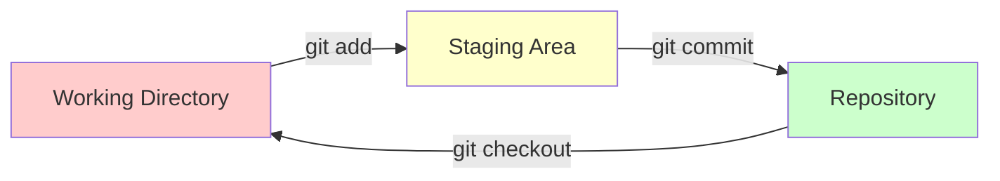
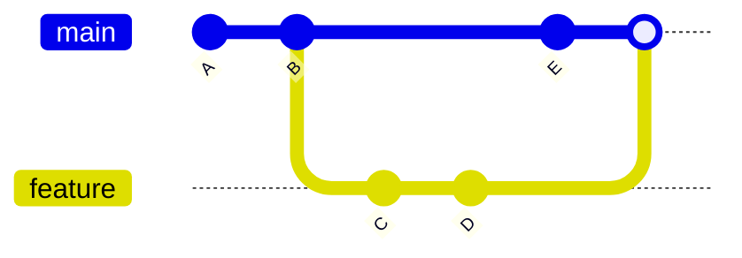
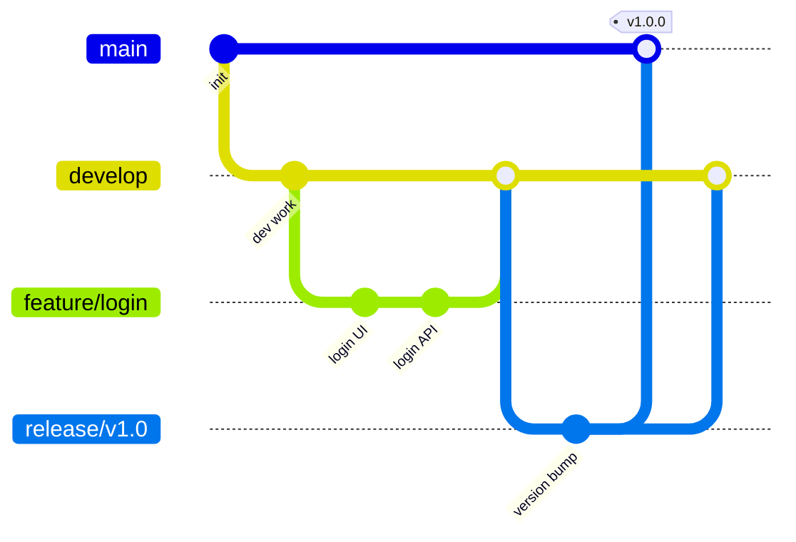
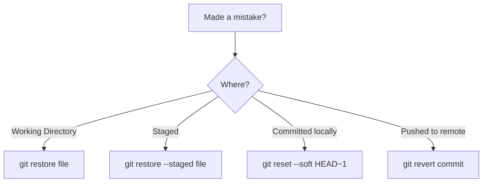
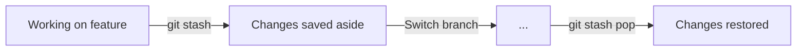

# Git Cheat Sheet

> Git is a version control system that tracks changes in your code locally.

---

## Setup (One-Time)

### Install Git

- **Windows**: Download from [git-scm.com](https://git-scm.com)
- **Mac**: `brew install git` or comes with Xcode
- **Linux**: `sudo apt install git`

### Configure Git

```bash
# Set your identity (required for commits)
git config --global user.name "Your Name"
git config --global user.email "your.email@example.com"

# Set default branch name
git config --global init.defaultBranch main

# Verify settings
git config --list
```

---

## The Three States



| State | Meaning |
|-------|---------|
| **Working Directory** | Your actual files (unsaved changes) |
| **Staging Area** | Changes ready to be committed |
| **Repository** | Permanently saved snapshots |

---

## Starting a Project

### Create a New Repository

```bash
# Initialize Git in current folder
git init

# Initialize in a new folder
git init my-project
cd my-project

# Initialize with a specific default branch
git init -b main
```

After `git init`, you'll have an empty repo. Next steps:
```bash
git add .
git commit -m "Initial commit"
# Then connect to GitHub (see GitHub notes)
```

### Clone an Existing Repository

```bash
# Clone to folder with repo name
git clone https://github.com/user/repo.git

# Clone to a specific folder name
git clone https://github.com/user/repo.git my-folder

# Clone only the latest commit (faster for large repos)
git clone --depth 1 https://github.com/user/repo.git

# Clone a specific branch
git clone -b develop https://github.com/user/repo.git

# Clone using SSH (if set up)
git clone git@github.com:user/repo.git
```

> [!TIP]
> After cloning, `cd` into the folder to start working!

---

## Daily Workflow

### Check What Changed

```bash
git status              # See which files changed
git log --oneline       # View commit history
git log --graph --oneline --all   # Visual branch history
git diff                # See actual changes in working dir
git diff --staged       # See changes staged for commit
```

### Save Your Work

```bash
git add .               # Stage all changes
git add <filename>      # Stage specific file
git commit -m "Your message here"

# Add and commit tracked files in one step
git commit -am "Your message here"
```

> [!TIP]
> **Before committing:** Always run `git status` to see what you're about to commit!

### Sync with Remote

```bash
git pull                # Get latest changes from remote
git push                # Upload your commits to remote

# First push of a new branch
git push -u origin <branch-name>
```

> [!IMPORTANT]
> **Before pushing:** Always `git pull` first to avoid conflicts!

---

## Branches



### Basic Commands

```bash
git branch              # List local branches
git branch -a           # List all branches (including remote)

git switch -c feature   # Create and switch to new branch
git switch main         # Switch to existing branch

git merge feature       # Merge branch into current branch

git branch -d feature   # Delete branch (safe, only if merged)
git branch -D feature   # Force delete branch

git branch -m <new-name>  # Rename current branch
```

> [!TIP]
> **Before switching branches:** Commit or stash your changes first!

---

## Branch Naming Best Practices

| Branch Type | Pattern | Example |
|-------------|---------|---------|
| **Feature** | `feature/description` | `feature/user-login` |
| **Bug Fix** | `fix/description` | `fix/cart-total` |
| **Hotfix** | `hotfix/description` | `hotfix/payment-crash` |
| **Release** | `release/version` | `release/v1.2.0` |
| **Chore** | `chore/description` | `chore/update-deps` |

### Branch Flow (GitFlow)



| Branch | Purpose |
|--------|---------|
| `main` | Production-ready code |
| `develop` | Integration branch |
| `feature/*` | New features |
| `release/*` | Prepare releases |
| `hotfix/*` | Emergency fixes |

---

## Pre-Action Checklist

### Before Starting New Work

```bash
git switch main         # Go to main branch
git pull                # Get latest code
git switch -c feature/my-task   # Create feature branch
```

### Before Committing

```bash
git status              # Review what's staged
git diff --staged       # Check actual changes
# Write clear commit message
```

### Before Pushing

```bash
git pull origin main    # Sync with remote
# Resolve any conflicts if needed
git push
```

### Before Creating PR

- [ ] Code works locally
- [ ] Tests pass
- [ ] No console.logs or debug code
- [ ] Branch is up-to-date with main

---

## Commit Message Best Practices

### The Golden Rules

1. **Write in imperative mood** — "Add feature" not "Added feature"
2. **Keep subject line under 50 characters**
3. **Capitalize the first letter** (after type prefix)
4. **No period at the end** of subject line
5. **Separate subject from body** with a blank line
6. **Explain what and why**, not how

### Format (Conventional Commits)

```
<type>(<scope>): <short description>

[optional body - what and why]

[optional footer - breaking changes, issue refs]
```

### Types

| Type | When to Use | Example |
|------|-------------|---------|
| `feat` | New feature | `feat: add dark mode toggle` |
| `fix` | Bug fix | `fix: prevent cart from clearing on refresh` |
| `docs` | Documentation | `docs: add API authentication guide` |
| `style` | Formatting only | `style: fix indentation in utils` |
| `refactor` | Code restructure | `refactor: extract email validation` |
| `perf` | Performance | `perf: optimize image loading` |
| `test` | Adding tests | `test: add unit tests for checkout` |
| `build` | Build system | `build: update webpack config` |
| `ci` | CI/CD changes | `ci: add GitHub Actions workflow` |
| `chore` | Maintenance | `chore: update dependencies` |
| `revert` | Revert commit | `revert: undo login changes` |

### Good Examples

```bash
# Feature with scope
git commit -m "feat(auth): add Google OAuth login"

# Bug fix with issue reference
git commit -m "fix(cart): resolve total calculation. Closes #123"

# Documentation
git commit -m "docs: add setup instructions to README"

# Refactoring
git commit -m "refactor(api): extract common error handling"

# Performance improvement
git commit -m "perf: lazy load dashboard components"

# Breaking change (add ! after type)
git commit -m "feat(api)!: change auth endpoint response format"
```

### Multi-line Commit (For Complex Changes)

```bash
git commit -m "feat(checkout): add payment processing

- Integrate Stripe API for card payments
- Add payment form validation
- Handle payment errors gracefully

BREAKING CHANGE: Payment API response format changed
Closes #456"
```

Or use editor for long messages:
```bash
git commit   # Opens editor for multi-line message
```

### Bad Examples (Don't Do This!)

```bash
# Too vague
git commit -m "fix bug"
git commit -m "update"
git commit -m "changes"
git commit -m "stuff"

# Not descriptive
git commit -m "fixed it"
git commit -m "WIP"
git commit -m "asdfasdf"

# Past tense (use imperative!)
git commit -m "added feature"
git commit -m "fixed the bug"

# Too long
git commit -m "fixed the bug where users couldn't login when they had special characters..."
```

### Quick Decision Guide

| Situation | Commit Message |
|-----------|---------------|
| Added new button | `feat(ui): add submit button to form` |
| Fixed crash | `fix: prevent crash on empty input` |
| Renamed variable | `refactor: rename userId to odioId` |
| Updated README | `docs: update installation steps` |
| Removed console.logs | `chore: remove debug statements` |
| Improved speed | `perf: cache API responses` |
| Added test | `test: add login validation tests` |

---

## Undoing Mistakes



```bash
# Discard changes in a file (not yet staged)
git restore <filename>

# Unstage a file (keep changes in working dir)
git restore --staged <filename>

# Undo last commit (keep changes staged)
git reset --soft HEAD~1

# Undo last commit (keep changes unstaged)
git reset HEAD~1

# Undo last commit (DISCARD changes) - DANGEROUS!
git reset --hard HEAD~1

# Undo a pushed commit (creates new commit - safe for shared branches)
git revert <commit-hash>

# Amend last commit (change message or add files)
git commit --amend -m "New message"
git commit --amend --no-edit   # Add forgotten files
```

> [!CAUTION]
> Never use `reset --hard` on commits that are already pushed!

---

## Stash (Save Work Temporarily)



```bash
git stash                       # Save current changes
git stash save "WIP: feature"   # Save with description
git stash list                  # See all stashes
git stash pop                   # Restore and remove from stash
git stash apply                 # Restore but keep in stash
git stash drop stash@{0}        # Delete specific stash
git stash clear                 # Delete ALL stashes
```

> [!TIP]
> Use stash when you need to switch branches but aren't ready to commit.

---

## Remote Management

```bash
git remote -v                              # View remotes
git remote add origin <url>                # Add a remote
git remote set-url origin <new-url>        # Change URL
git remote remove origin                   # Remove remote

git fetch origin                           # Download without merging
git pull origin main                       # Fetch and merge
```

---

## Handling Merge Conflicts

When two people edit the same line:

```diff
<<<<<<< HEAD
Your changes
=======
Their changes
>>>>>>> feature-branch
```

**To resolve:**

1. Open the file, decide what to keep
2. Remove conflict markers (`<<<<<<<`, `=======`, `>>>>>>>`)
3. Stage and commit:

```bash
git add <filename>
git commit -m "fix: resolve merge conflict"
```

---

## Common Scenarios

### Undo last commit (keep changes)
```bash
git reset --soft HEAD~1
```

### Committed to wrong branch
```bash
git reset --soft HEAD~1   # Undo commit
git stash                 # Save changes
git switch correct-branch
git stash pop             # Apply changes
git commit -m "message"
```

### Discard all local changes
```bash
git checkout .            # Discard file changes
git clean -fd             # Remove untracked files/folders
```

### Recover deleted branch
```bash
git reflog                # Find the commit hash
git branch recovered-branch <commit-hash>
```

### Update PR with latest main
```bash
git switch main
git pull
git switch my-feature-branch
git merge main            # or git rebase main
git push
```

### View who changed a line
```bash
git blame <filename>
```

### Search commit history
```bash
git log --oneline -S "search term"
```

---

## Quick Reference

| Task          | Command                       |
| ------------- | ----------------------------- |
| Initialize    | `git init`                    |
| Clone         | `git clone <url>`             |
| Status        | `git status`                  |
| Diff          | `git diff`                    |
| Stage         | `git add .`                   |
| Commit        | `git commit -m "msg"`         |
| Push          | `git push`                    |
| Pull          | `git pull`                    |
| Fetch         | `git fetch`                   |
| New Branch    | `git switch -c <name>`        |
| Switch Branch | `git switch <name>`           |
| Merge         | `git merge <branch>`          |
| Stash         | `git stash` / `git stash pop` |
| Undo changes  | `git restore <file>`          |
| Unstage       | `git restore --staged <file>` |
| Undo commit   | `git reset --soft HEAD~1`     |
| View history  | `git log --oneline`           |
| View remotes  | `git remote -v`               |

---

## Git Best Practices

### Before You Start Coding

| Do | Don't |
|----|-------|
| Pull latest from main | Start coding on stale code |
| Create a new branch | Work directly on main |
| Use descriptive branch name | Use `my-branch` or `test` |

```bash
# Good start
git switch main
git pull
git switch -c feature/add-user-profile
```

### While Coding

| Do | Don't |
|----|-------|
| Commit often (small chunks) | Make one giant commit |
| Write clear commit messages | Write "WIP" or "fix" |
| Stage specific files when needed | Always use `git add .` blindly |
| Review your diff before committing | Commit without checking |

```bash
# Review before committing
git diff                    # Check working changes
git add -p                  # Stage interactively (choose hunks)
git diff --staged           # Review what you're about to commit
git commit -m "feat: ..."
```

### Staging Best Practices

```bash
# Stage specific files (better control)
git add src/components/Login.js
git add src/utils/auth.js

# Stage interactively (pick specific changes)
git add -p

# Stage all changes in a directory
git add src/components/

# Unstage if you added wrong files
git restore --staged <file>
```

> [!TIP]
> Use `git add -p` to review and stage changes piece by piece. Perfect for splitting work into multiple commits!

### Working with Remote

| Do | Don't |
|----|-------|
| Pull before pushing | Push without pulling |
| Push regularly (backup) | Keep work only locally |
| Use `--force-with-lease` if needed | Use `--force` blindly |

```bash
# Safe force push (only if no one else pushed)
git push --force-with-lease

# Regular sync
git pull
git push
```

### Code Review Preparation

Before creating a PR, run through this:

```bash
# 1. Review your own changes
git diff main...HEAD          # All changes in your branch

# 2. Check commit history
git log --oneline main..HEAD  # Commits in your branch

# 3. Make sure tests pass locally
npm test                      # or your test command

# 4. Update with latest main
git switch main
git pull
git switch my-feature
git merge main                # or rebase

# 5. Push and create PR
git push
```

### Things to Avoid

| Avoid | Why | Do Instead |
|-------|-----|------------|
| `git add .` without checking | May add unwanted files | `git status` first, then add |
| Committing directly to main | Breaks team workflow | Use feature branches |
| Giant commits | Hard to review and debug | Small, focused commits |
| Force pushing to shared branches | Overwrites others' work | Communicate first |
| Ignoring conflicts | Leads to broken code | Resolve carefully |
| Vague commit messages | Hard to understand history | Be descriptive |

### .gitignore Essentials

Always have a `.gitignore` file:

```bash
# Dependencies
node_modules/
vendor/

# Build output
dist/
build/
.next/

# Environment files (secrets!)
.env
.env.local
.env.*.local

# IDE settings
.vscode/
.idea/

# OS files
.DS_Store
Thumbs.db

# Logs
*.log
npm-debug.log*
```

> [!IMPORTANT]
> Never commit `.env` files, API keys, passwords, or secrets!

---

## Senior Dev Habits

### Daily Routine

```bash
# Morning: Sync up
git fetch origin
git switch main
git pull

# Start task
git switch -c feature/ticket-123-description

# During work: Commit often with clear messages
git add .
git commit -m "feat: add login form UI"

# End of day: Push your work (backup!)
git push -u origin feature/ticket-123-description
```

### Golden Rules

| Rule | Why |
|------|-----|
| Pull before you push | Avoid conflicts |
| Commit often | Easier to undo & track |
| Small, focused commits | Easier to review & debug |
| Clear commit messages | Future you will thank you |
| One feature = one branch | Keep changes isolated |
| Delete merged branches | Keep repo clean |
| Never force push to shared branches | Protects others' work |
| Review your own diff before committing | Catch mistakes early |

### Before Any Destructive Command

```bash
# Create a backup branch first
git branch backup-before-reset
# Now safe to experiment
```

---

> **See also:** [[GitHub]] for collaboration features like Pull Requests, Issues, and Actions.
