# Git

> Git is a **distributed version control system** created by Linus Torvalds in 2005 in just five days following a license dispute with BitKeeper.

---

## Part 1: Git Basics & Internals (Solo Development)

### 1. Core Philosophy: Snapshots vs. Deltas

Unlike the common misconception that Git stores "diffs" (changes), it actually stores a **snapshot** of the entire repository for every commit.


> [!TIP]
> Git remains efficient by compressing files and de-duplicating identical files using content-addressable storage (SHA-1 hashes as pointers).

---

### 2. Plumbing vs. Porcelain

| Type | Description | Examples |
|------|-------------|----------|
| **Porcelain** | High-level commands (99% of usage) | `git add`, `git commit`, `git log` |
| **Plumbing** | Low-level data manipulation | `git cat-file`, `git hash-object` |

#### Git Object Model

```mermaid
graph TD
    Commit["🔷 Commit"] --> Tree["📁 Tree (Directory)"]
    Tree --> Blob1["📄 Blob (File)"]
    Tree --> Blob2["📄 Blob (File)"]
    Tree --> SubTree["📁 SubTree"]
    SubTree --> Blob3["📄 Blob (File)"]
```



```bash
# Inspect any git object
git cat-file -p <hash>

# Show object type
git cat-file -t <hash>
```

> [!NOTE]
> The `.git` directory contains the entire state of the project. Everything Git knows is stored here.

---

### 3. Configuration Hierarchy

Configs cascade from least to most specific:

```
System → Global → Local (wins)
```

| Level | Location | Flag |
|-------|----------|------|
| System | `/etc/gitconfig` | `--system` |
| Global | `~/.gitconfig` | `--global` |
| Local | `.git/config` | `--local` |

```bash
# Essential setup
git config --global user.name "Your Name"
git config --global user.email "you@example.com"
git config --global init.defaultBranch main

# View all configs (with origin)
git config --list --show-origin

# View project-specific settings
git config --local --list
```

---

### 4. The Three States

```mermaid
graph LR
    WD["📂 Working Directory"] -->|git add| SA["📋 Staging Area<br/>(Index)"]
    SA -->|git commit| Repo["🗄️ Repository<br/>(.git)"]
    Repo -->|git checkout| WD
    
    style WD fill:#ffcccc
    style SA fill:#ffffcc
    style Repo fill:#ccffcc
```



| State | Description | Risk if Lost |
|-------|-------------|--------------|
| **Untracked** | Git sees it but isn't tracking | ⚠️ Gone forever |
| **Staged** | Ready for next commit | Can be recovered |
| **Committed** | Saved to database | ✅ Safe |

```bash
git status              # Check current state
git add <file>          # Stage a file
git add .               # Stage all changes
git commit -m "msg"     # Commit staged changes
```

---

### 5. Branching

> A branch is simply a **lightweight, mutable pointer** to a specific commit.


```bash
# Create and switch (modern)
git switch -c <branch-name>

# Create and switch (classic)
git checkout -b <branch-name>

# Switch to existing branch
git switch <branch-name>

# List branches
git branch -a           # All (local + remote)

# Delete branch
git branch -d <name>    # Safe delete (merged only)
git branch -D <name>    # Force delete
```

---

### 6. Merging

#### Fast-Forward Merge
When the target is a direct ancestor Git just moves the pointer forward.


#### Three-Way Merge
When histories diverge  Git creates a new **merge commit** with two parents.

```bash
git merge <branch>              # Merge into current branch
git merge --no-ff <branch>      # Force merge commit
git merge --squash <branch>     # Squash all commits into one
git merge --abort               # Cancel merge in progress
```

---

### 7. Rebasing

> Rebasing **replays** your commits on top of another branch, creating a linear history.


After `git rebase main` from feature branch:


```bash
git rebase <branch>             # Rebase onto branch
git rebase -i HEAD~3            # Interactive rebase (last 3 commits)
git rebase --continue           # After resolving conflicts
git rebase --abort              # Cancel rebase
```

> [!CAUTION]
> **Golden Rule:** Never rebase a public branch (like `main`) that others are working on it destroys their history!

---

### 8. Undoing Changes

| Command | Staged | Working Dir | Safe? |
|---------|--------|-------------|-------|
| `--amend` | ✓ | ✓ | ✅ (last commit only) |
| `reset --soft` | Keeps | Keeps | ✅ |
| `reset --mixed` | Unstages | Keeps | ✅ |
| `reset --hard` | Discards | Discards | ⚠️ DANGEROUS |

```bash
# Amend last commit
git commit --amend -m "New message"
git commit --amend --no-edit    # Add forgotten files

# Reset commands
git reset --soft HEAD~1         # Undo commit, keep staged
git reset HEAD~1                # Undo commit, unstage changes
git reset --hard HEAD~1         # ⚠️ Destroy everything

# Discard working directory changes
git restore <file>              # Modern
git checkout -- <file>          # Classic
```

---

### 9. Remotes & GitHub

> A remote is just **another copy** of the repository it can be GitHub, GitLab, or even another folder!

```bash
git remote -v                           # View remotes
git remote add origin <url>             # Add remote
git remote set-url origin <new-url>     # Change URL

git push -u origin main                 # Push and set upstream
git pull origin main                    # Fetch + merge
git fetch origin                        # Download without merging
```

#### Origin vs. Upstream Convention

| Remote | Points To |
|--------|-----------|
| `origin` | Your fork |
| `upstream` | The original repo (company/OSS) |

---

## Part 2: Team Workflow & Advanced Git

### 1. Forking Workflow

> **Fork** is a GitHub feature (not Git!) it copies a repo to your account.


```bash
# Setup after forking
git clone <your-fork-url>
git remote add upstream <original-repo-url>

# Keep fork updated
git fetch upstream
git merge upstream/main
```

---

### 2. Reflog (Your Safety Net)

> **Reflog** tracks every movement of HEAD it's your safety net for recovering "lost" commits!

```bash
git reflog                      # View HEAD history
git checkout HEAD@{2}           # Go back 2 moves
git branch recover HEAD@{5}     # Recover deleted branch
```

> [!TIP]
> Even after `reset --hard` or deleting a branch, commits are still recoverable via reflog for ~90 days!

---

### 3. Merge Conflicts

Conflicts happen when two commits modify the **same line** of the same file.

```diff
<<<<<<< HEAD
Your changes
=======
Their changes
>>>>>>> feature-branch
```

```bash
# Resolution strategies
git checkout --ours <file>      # Keep current branch version
git checkout --theirs <file>    # Keep incoming branch version

# After resolving
git add <file>
git commit
```

---

### 4. Rebasing with Conflicts

> [!WARNING]
> **The Ours/Theirs Swap:** During rebase, `--ours` means the target branch and `--theirs` means YOUR commits!

This is because rebase checks out the target first, then replays your work.

```bash
# During conflict
git checkout --ours <file>      # Keep target (main)
git checkout --theirs <file>    # Keep your changes

git rebase --continue           # After resolving
```

---

### 5. RERERE (Reuse Recorded Resolution)

> RERERE remembers how you resolved conflicts Git auto-resolves the same conflict next time!

```bash
git config --global rerere.enabled true
```

---

### 6. Squashing Commits

> Combine multiple commits into one for a cleaner history.

```bash
git rebase -i HEAD~3            # Interactive rebase last 3 commits
```

In the editor:
```
pick abc1234 First commit
squash def5678 Second commit    # Will be merged into first
squash ghi9012 Third commit     # Will be merged into first
```

---

### 7. Stashing

> Temporarily save uncommitted work to switch contexts.

```bash
git stash                       # Stash changes
git stash save "WIP: feature"   # With description
git stash list                  # View all stashes
git stash pop                   # Apply + remove from list
git stash apply                 # Apply but keep in list
git stash drop stash@{1}        # Remove specific stash
git stash clear                 # Remove ALL stashes
```

> [!NOTE]
> Stash is a **Stack** (LIFO) ast stashed = first popped.

---

### 8. Reverting

> Creates a **new commit** that undoes a previous commit safe for public branches!

```bash
git revert <commit-hash>        # Undo specific commit
git revert HEAD                 # Undo last commit
git revert -m 1 <merge-hash>    # Revert a merge commit
```

---

### 9. Cherry-Picking

> Copy a specific commit from one branch to another.

```bash
git cherry-pick <commit-hash>           # Apply commit
git cherry-pick <hash1> <hash2>         # Multiple commits
git cherry-pick --no-commit <hash>      # Stage without committing
```

---

### 10. Bisect

> **Binary search** to find the commit that introduced a bug.

```bash
git bisect start
git bisect bad                  # Current commit is broken
git bisect good <old-commit>    # This commit was working

# Git will checkout middle commit—test and mark:
git bisect good                 # or
git bisect bad

git bisect reset                # When done

# Automate with a script
git bisect run ./test-script.sh
```

---

### 11. Worktrees

> Check out multiple branches in different directories simultaneously.

```bash
git worktree add ../feature-branch feature
git worktree list
git worktree remove ../feature-branch
```

> [!TIP]
> Perfect for reviewing PRs while keeping your work-in-progress untouched!

---

### 12. Tags

> **Immutable pointers** to specific commits used for releases.

```bash
git tag v1.0.0                          # Lightweight tag
git tag -a v1.0.0 -m "Release 1.0"      # Annotated tag (recommended)
git push origin v1.0.0                  # Push specific tag
git push origin --tags                  # Push all tags
```

#### Semantic Versioning (SemVer)

```
MAJOR.MINOR.PATCH
  │     │     └── Bug fixes (backward compatible)
  │     └── New features (backward compatible)
  └── Breaking changes
```

---

## Quick Reference Card

| Task | Command |
|------|---------|
| Initialize | `git init` |
| Clone | `git clone <url>` |
| Status | `git status` |
| Stage | `git add .` |
| Commit | `git commit -m "msg"` |
| Push | `git push origin main` |
| Pull | `git pull origin main` |
| Branch | `git switch -c <name>` |
| Merge | `git merge <branch>` |
| Rebase | `git rebase <branch>` |
| Stash | `git stash` / `git stash pop` |
| Undo | `git restore <file>` |
| History | `git log --oneline --graph` |
| Remotes | `git remote -v` |

---

> **Last Updated:** 2025-12-20
