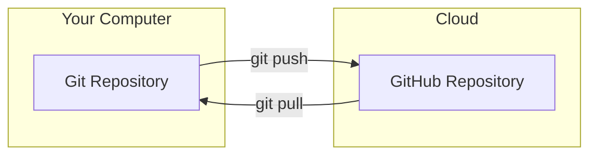
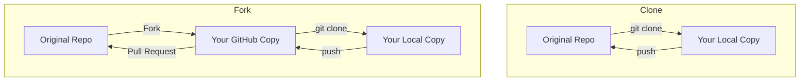
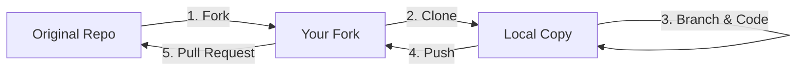
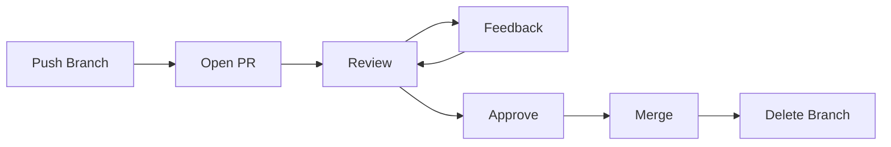

# GitHub

> GitHub is a cloud platform that hosts Git repositories and adds collaboration features.

---

## Git vs GitHub



| Feature | Git | GitHub |
|---------|-----|--------|
| **What is it** | Software (tool) | Website/Platform |
| **Where** | Runs on your computer | Cloud service |
| **Purpose** | Track changes locally | Host & share code online |
| **Cost** | Free & open source | Free (with paid tiers) |
| **Collaboration** | Basic | PRs, Issues, Actions, Projects |

> [!NOTE]
> Git works without GitHub. GitHub needs Git to function.

---

## Setup Authentication

### SSH Key (Recommended)

```bash
# Generate SSH key
ssh-keygen -t ed25519 -C "your.email@example.com"

# Start ssh-agent
eval "$(ssh-agent -s)"

# Add key to agent
ssh-add ~/.ssh/id_ed25519

# Copy public key
cat ~/.ssh/id_ed25519.pub
# Then add to GitHub > Settings > SSH Keys
```

### HTTPS with Token

1. Go to GitHub > Settings > Developer Settings > Personal Access Tokens
2. Generate new token with `repo` permissions
3. Use token as password when pushing

### Test Connection

```bash
ssh -T git@github.com
# Should see: "Hi username! You've successfully authenticated"
```

---

## Creating a Repository

### On GitHub Website

1. Click **+** → **New repository**
2. Fill in:
   - Repository name
   - Description (optional)
   - Public or Private
   - Initialize with README (optional)
3. Click **Create repository**

### Connect Local Repo to GitHub

```bash
# If starting fresh
git init
git add .
git commit -m "Initial commit"
git remote add origin https://github.com/username/repo.git
git branch -M main
git push -u origin main
```

### Clone Existing Repo

```bash
# HTTPS
git clone https://github.com/username/repo.git

# SSH
git clone git@github.com:username/repo.git

# Clone to specific folder
git clone https://github.com/username/repo.git my-folder
```

---

## Cloning vs Forking



| Action | When to Use |
|--------|------------|
| **Clone** | You have write access to the repo |
| **Fork** | Contributing to someone else's project |

---

## Forking Workflow

> For contributing to open source projects.



```bash
# 1. Fork on GitHub (click Fork button)

# 2. Clone YOUR fork
git clone https://github.com/YOUR-USERNAME/repo.git
cd repo

# 3. Add original repo as "upstream"
git remote add upstream https://github.com/ORIGINAL-OWNER/repo.git

# 4. Create feature branch
git switch -c feature/my-contribution

# 5. Make changes and commit
git add .
git commit -m "feat: add new feature"

# 6. Push to YOUR fork
git push origin feature/my-contribution

# 7. Go to GitHub and create Pull Request
```

### Keep Fork Updated

```bash
git fetch upstream
git switch main
git merge upstream/main
git push origin main
```

---

## Pull Requests (PRs)

### What is a Pull Request?

A PR is a request to merge your changes into another branch. It enables:
- Code review before merging
- Discussion about changes
- Automated tests to run

### Creating a Pull Request



**Steps:**

1. Push your branch
   ```bash
   git push -u origin feature/login
   ```

2. Go to GitHub → Click "Compare & pull request"

3. Fill in details:
   - **Title**: Clear, descriptive title
   - **Description**: What changes? Why? How to test?
   - **Reviewers**: Add team members
   - **Labels**: bug, feature, documentation, etc.

4. Click "Create Pull Request"

### PR Description Template

```markdown
## What does this PR do?
Adds user login functionality with email/password authentication.

## Changes Made
- Added login form component
- Integrated with authentication API
- Added error handling for invalid credentials

## How to Test
1. Go to /login
2. Enter valid credentials
3. Should redirect to dashboard

## Screenshots (if UI changes)
[Add screenshots here]

## Related Issues
Closes #123
```

### Reviewing a PR

1. Go to **Files changed** tab
2. Click on lines to add comments
3. Use suggestions for code changes:
   ````markdown
   ```suggestion
   const user = await getUser(id);
   ```
   ````
4. Click **Review changes**:
   - **Comment** - Just feedback, no approval
   - **Approve** - Ready to merge
   - **Request changes** - Must fix before merging

### Merge Strategies

| Strategy | What it Does | When to Use |
|----------|--------------|-------------|
| **Merge commit** | Creates merge commit, keeps all commits | Default, preserves full history |
| **Squash and merge** | Combines all commits into one | Clean history, many small commits |
| **Rebase and merge** | Replays commits on top of base | Linear history, advanced |

---

## Issues

### What are Issues?

Track bugs, features, tasks, and questions.

### Creating an Issue

1. Go to **Issues** tab → **New issue**
2. Add title and description
3. Add labels, assignees, milestone

### Issue Labels (Common)

| Label | Meaning |
|-------|---------|
| `bug` | Something isn't working |
| `enhancement` | New feature request |
| `documentation` | Docs improvements |
| `good first issue` | Good for newcomers |
| `help wanted` | Need help with this |
| `wontfix` | Won't be worked on |

### Issue Template (Bug Report)

```markdown
## Bug Report

**Describe the bug**
Cart total shows wrong amount after updating quantity.

**Steps to reproduce**
1. Add item to cart
2. Change quantity to 2
3. Total still shows price for 1 item

**Expected behavior**
Total should update when quantity changes.

**Screenshots**
[Add if applicable]

**Environment**
- Browser: Chrome 120
- OS: Windows 11
```

### Issue Template (Feature Request)

```markdown
## Feature Request

**Is your feature request related to a problem?**
It's frustrating when I can't filter products by price.

**Describe the solution you'd like**
Add a price range slider to the product listing page.

**Describe alternatives you've considered**
Could also use min/max input fields.

**Additional context**
This would help users find products in their budget quickly.
```

### Linking Issues to Commits/PRs

```bash
# Reference issue (creates link)
git commit -m "fix: update cart calculation #123"

# Auto-close issue when PR is merged
git commit -m "fix: update cart calculation. Closes #123"

# Close multiple issues
git commit -m "feat: add checkout. Closes #123, closes #124"
```

**Keywords that close issues:**
- `Closes #123`
- `Fixes #123`
- `Resolves #123`

---

## GitHub Actions (CI/CD)

Automate testing, building, and deployment.

### Basic Test Workflow

Create `.github/workflows/ci.yml`:

```yaml
name: CI

on:
  push:
    branches: [main]
  pull_request:
    branches: [main]

jobs:
  test:
    runs-on: ubuntu-latest
    steps:
      - uses: actions/checkout@v4
      
      - uses: actions/setup-node@v4
        with:
          node-version: '20'
          
      - run: npm install
      - run: npm test
```

### Deploy to GitHub Pages

```yaml
name: Deploy

on:
  push:
    branches: [main]

jobs:
  deploy:
    runs-on: ubuntu-latest
    steps:
      - uses: actions/checkout@v4
      
      - run: npm install
      - run: npm run build
      
      - uses: peaceiris/actions-gh-pages@v3
        with:
          github_token: ${{ secrets.GITHUB_TOKEN }}
          publish_dir: ./dist
```

---

## GitHub Features

| Feature | Description |
|---------|-------------|
| **Pull Requests** | Propose and review code changes |
| **Issues** | Track bugs, features, and tasks |
| **Actions** | CI/CD automation |
| **Projects** | Kanban boards for planning |
| **Wiki** | Documentation pages |
| **Pages** | Free static website hosting |
| **Discussions** | Community Q&A forum |
| **Releases** | Version your software |
| **Gists** | Share code snippets |

---

## Remote Conventions

| Remote | Points To |
|--------|-----------|
| `origin` | Your repository (or your fork) |
| `upstream` | Original repository (when forking) |

```bash
git remote -v                    # View remotes
git remote add upstream <url>    # Add upstream
git fetch upstream               # Get upstream changes
```

---

## Quick Reference

| Task | How |
|------|-----|
| Create repo | GitHub → + → New repository |
| Fork repo | GitHub → Fork button |
| Clone repo | `git clone <url>` |
| Create PR | Push branch → Compare & pull request |
| Request review | PR → Reviewers → Add |
| Create Issue | Issues → New issue |
| Review PR | PR → Files changed → Review |
| Merge PR | PR → Merge pull request |
| Close Issue | Commit with "Closes #123" |
| Enable Actions | Settings → Actions → Allow |

---

## PR Checklist

Before creating a PR:

- [ ] Code works locally
- [ ] Tests pass
- [ ] No debug code or console.logs
- [ ] Branch is up-to-date with main
- [ ] Clear, descriptive PR title
- [ ] Description explains what & why
- [ ] Related issues are linked
- [ ] Self-reviewed the diff

---

## Common Scenarios

### Someone requested changes on my PR
```bash
# Make the requested changes locally
git add .
git commit -m "fix: address review comments"
git push
# PR automatically updates
```

### My PR has conflicts with main
```bash
git switch main
git pull
git switch my-feature-branch
git merge main
# Resolve conflicts
git add .
git commit -m "fix: resolve merge conflicts"
git push
```

### I want to update my fork
```bash
git fetch upstream
git switch main
git merge upstream/main
git push origin main
```

---

> **See also:** [[Git]] for core Git commands and concepts.
